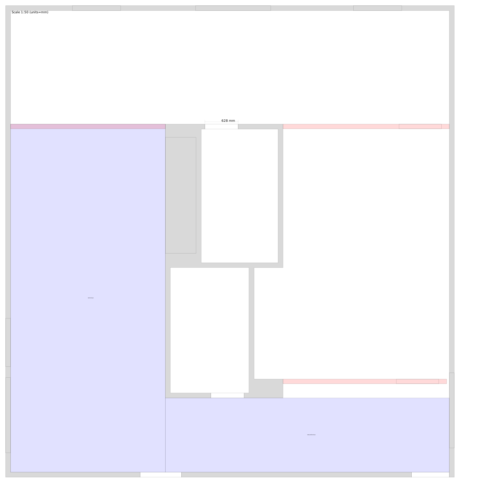

# Projeto Basement — Lição 0  

## Quantitativos, Orçamento e Execução (base auditada)

**Base aceita (sem achismo):**
- Comprimento total das divisórias: **9.157 m**
- Altura padrão: **2.400 m**
- Área líquida de drywall (2 lados): **37.45 m²**
- Portas: **2 × (800 × 2032 mm)**

---

## 📐 Quantitativos finais

### 🧱 Drywall
- Área líquida total (2 lados): **37.45 m²**
- Placa padrão: **4×8 ft**  
  (1.22 × 2.44 m ≈ **2.98 m²**)

**Cálculo:**
- 37.45 ÷ 2.98 ≈ **12.56 placas**
- + **15% desperdício DIY**

➡️ **Drywall 1/2": 15 placas**

---

### 🪵 Estrutura 2×4

#### Montantes verticais
- Espaçamento: **400 mm**
- 9.157 ÷ 0.4 ≈ **23 montantes**
- Extras (quinas + portas): **+6**

➡️ **Total: ~29 studs**

#### Soleiras + travessas
- Base + topo contínuos:
  - 9.157 × 2 = **18.3 m**
- Portas (headers + reforços): **~4 m**

➡️ **2×4 lineares: ~22–23 m**

**Conversão prática:**
- 2×4×8 ft (2.44 m)
- 23 ÷ 2.44 ≈ **10 peças**
- + margem → **12 peças**

---

### 🚪 Portas
- Porta interna oca padrão: **2 unidades**
- Batente incluso
- Guarnição simples

---

### 🔩 Fixações e consumíveis
- Parafusos drywall: **~1.200**
- Parafusos madeira: **1 caixa**
- Fita drywall: **1 rolo**
- Massa drywall: **1 balde grande**
- Shims: **1 pacote**
- Selante acrílico: **2 tubos**

---

## 💰 Orçamento (Québec – ordem de grandeza)

### 🟢 Econômico — *Lição 0*
**~ CAD 750 – 900**
- Drywall (15 placas)
- Madeira 2×4
- 2 portas ocas
- Consumíveis básicos
- Sem isolamento

### 🔵 Conforto
**~ CAD 1 000 – 1 150**
- Tudo do econômico
- Isolamento acústico apenas na parede do cinema
- Vedação simples de porta (cinema)

### 🟣 “De verdade”
**~ CAD 1 400 – 1 600**
- Isolamento melhor
- Drywall mais pesado no cinema
- Porta melhor vedada
- Acabamento mais limpo

---

## 🛠️ Execução — tempo DIY realista

| Etapa | Tempo |
|-----|------|
| Marcação + estrutura | 1.5 dias |
| Portas + ajustes | 0.5 dia |
| Drywall | 1.5 dias |
| Acabamento | 2–3 dias |
| **Total** | **~6 dias úteis** |

---

## ⚠️ Pontos críticos (não errar)
- Porta: instalação com calma (nível + prumo)
- Drywall: parafuso nem raso, nem afundado
- Nada encosta no radiador
- Snap line perfeita no piso

---

## Encerramento
O erro inicial foi identificado, corrigido e descartado.  
A partir deste ponto:

- Base numérica auditada
- Método explícito
- Sem inferência visual
- Sem “olhômetro”

Este documento substitui qualquer quantitativo anterior.
